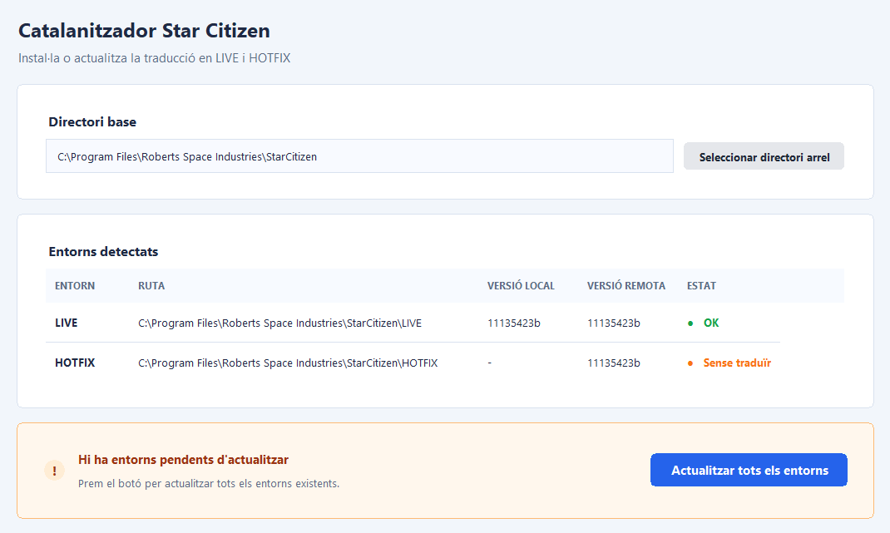

# Catalanitzador Star Citizen

Traducció ràpida, simple i sense històries. Aquest programa et detecta els entorns de **Star Citizen** i et posa la traducció al dia en un clic.


## Què fa?
- Detecta automàticament els entorns **LIVE** i **HOTFIX**
- Comprova versions locals vs remota
- Et permet actualitzar la traducció quan toca

## Com utilitzar-lo
### Opció 1: executant el Python
```bash
python "catalanitzadorSC.py"
```

### Opció 2: baixant l’EXE
Descarrega [l’última release](releases/latest) i executa l’`exe` directament.

> Nota: l’EXE no està firmat. Està autogenerat per GitHub Actions a cada release (pots comprovar-ho als workflows del repositori).

## Notes ràpides
- Si un entorn no té traducció, t’ho indica com **“Sense traduïr”**
- Només es mostren els entorns detectats (LIVE / HOTFIX)

## On trobar-nos
[starcitizen.cat](https://www.starcitizen.cat/)

---

Fet amb ☕ i moltes ganes de veure el mobiGlas en català.